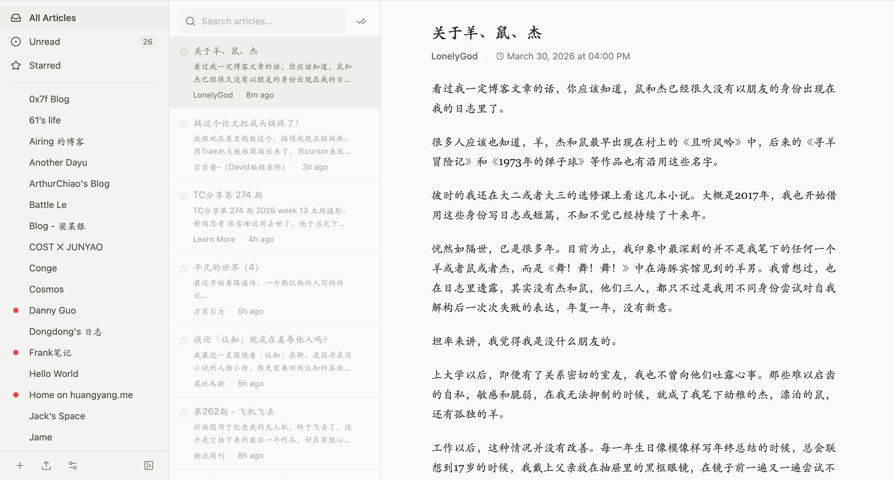

# RSS Reader

一个简洁的三栏布局自部署 RSS 阅读器。

## 功能

- 订阅 RSS/Atom 源
- 三栏布局：侧边栏、文章列表、阅读面板
- 侧边栏可折叠，支持沉浸式阅读
- 分类管理订阅源
- OPML 导入/导出
- 文章收藏
- 标记已读/未读
- 每 5 分钟自动刷新
- 订阅源健康状态监测
- 全文搜索

## 技术栈

- **前端**：React + TypeScript + Vite + Tailwind CSS
- **后端**：Express + TypeScript + sql.js (SQLite)

## 启动项目

### 环境要求

- Node.js >= 18

### 一键启动

```bash
chmod +x start.sh
./start.sh
```

### 手动启动

```bash
# 安装依赖
cd server && npm install && cd ..
cd client && npm install && cd ..

# 启动后端（端口 3001）
cd server && npm run dev &

# 启动前端（端口 5173）
cd client && npm run dev
```

浏览器打开 http://localhost:5173 即可使用。

